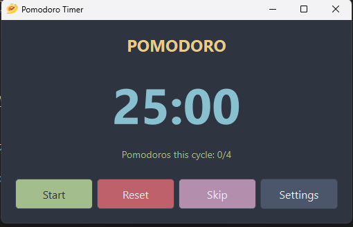

# Pomodoro Timer App

A simple Pomodoro timer application built with Python and PySide6 to help you stay focused and productive.

 

## Features

*   **Pomodoro Timer:** Standard 25-minute work sessions.
*   **Short Breaks:** 5-minute short breaks.
*   **Long Breaks:** 15-minute long breaks after a cycle of Pomodoros.
*   **Customizable Cycle:** Set how many Pomodoros before a long break.
*   **Sound Notifications:** Get notified when a session or break ends.
*   **Visual Timer:** Clear display of the time remaining.
*   **Session Tracking:** See how many Pomodoros you\'ve completed in the current cycle.
*   **Auto-start Option:** Breaks automatically start the next Pomodoro session. Pomodoro sessions require manual start for breaks.
*   **Custom UI:** Styled interface for a pleasant user experience.
*   **Cross-platform (source):** Can be run from source on Windows, macOS, and Linux if Python and PySide6 are installed.
*   **Packaged for Windows:** Includes a `.exe` file for easy running on Windows without installing Python.

## How to Run (Recommended for End-Users)

The easiest way to run the Pomodoro Timer App on Windows is to download the pre-built executable (`.exe`) file.

1.  **Go to the [Releases Page](https://github.com/4bdurr/PomodoroApp/releases/)**. 
2.  Look for the latest release.
3.  Under the "Assets" section of the latest release, download the `PomodoroApp.exe` file.
4.  Save the `PomodoroApp.exe` file to a location on your computer.
5.  Double-click `PomodoroApp.exe` to run the application. No installation is needed!

## How to Build from Source (For Developers)

If you want to build the application from the source code yourself, follow these steps:

**Prerequisites:**

*   [Python](https://www.python.org/downloads/) (version 3.8 or newer recommended)
*   [Git](https://git-scm.com/downloads/)

**Setup:**

1.  **Clone the repository:**
    ```bash
    git clone https://github.com/4bdurr/PomodoroApp.git
    cd PomodoroApp 
    ```
    *(Ganti `/4bdurr/PomodoroApp` dengan username dan nama repositori GitHub Anda)*

2.  **Create a virtual environment (recommended):**
    ```bash
    python -m venv venv
    ```
    Activate the virtual environment:
    *   On Windows (PowerShell/CMD):
        ```powershell
        .\venv\Scripts\Activate.ps1 
        # atau .\venv\Scripts\activate.bat
        ```
    *   On macOS/Linux:
        ```bash
        source venv/bin/activate
        ```

3.  **Install dependencies:**
    The application requires `PySide6`. For building, you\'ll also need `PyInstaller`.
    ```bash
    pip install PySide6 PyInstaller
    ```

4.  **Run the application from source (optional, for testing):**
    ```bash
    python main.py
    ```

5.  **Build the executable:**
    This project uses PyInstaller and a `.spec` file (`PomodoroApp.spec`) to bundle the application into a single executable.
    *   Ensure you have `my_pomodoro_icon.ico` in the `assets` folder if you haven\'t already. You can convert `my_pomodoro_icon.png` using an online converter or image editor.
    *   Run PyInstaller with the spec file:
        ```bash
        pyinstaller PomodoroApp.spec
        ```
    *   The executable will be located in the `dist/PomodoroApp` folder (as `PomodoroApp.exe`). If you used the `--onefile` option in your spec or command, it will be directly in `dist/PomodoroApp.exe`.

## Assets / Resources

*   **Application Icon:** `assets/my_pomodoro_icon.png` (source), `assets/my_pomodoro_icon.ico` (for executable)
*   **Notification Sound:** `assets/notification.wav`
*   **Styling:** `styles.qss`
